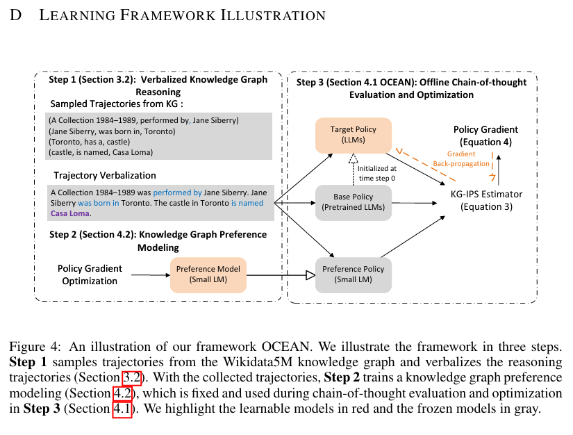

# OCEAN: OFFLINE CHAIN-OF-THOUGHT EVALUATION AND ALIGNMENT IN LARGE LANGUAGE MODELS

> DOI:
> publication: ICLR 2025 (POSTER)
> Date of publication: 2024-10-31

---
<!-- more -->

## Structure

### Step 1: Modeling Chain of Thought as MDP
* CHAIN-OF-THOUGHT
    * query $q$
    * reasoning steps $\mathbf{c} = (c_1, c_2, \cdots, c_T)$

        $c_t = \prod_{i=1}^{t-1} \pi_\theta(c_i|q, c_{< i})$

    * answer $y = \pi_\theta(y|q, \mathbf{c}) \prod_{i=1}^T \pi_\theta(c_i|q, c_{< i})$

* Markov Decision Process(MDP)
    * Markov Property: The current state contains all the necessary information for the future state
    * finite action space: token set $a_t \in |V|$
    surrounding context: $c_t / a_t$
    * every action step:

        generate next state

        $𝑠_{t+1}=[𝑠_𝑡, 𝑐_𝑡]$

        reward to define policy

        $r_t=r(𝑠_𝑡, 𝑐_𝑡)$

### Step 2: Verbalized Knowledge Graph Reasoning
#### modeling tractory
* trajectory
    * query $q$ $\to$ decomposed triple $(e_0, r_1, e_1)$
    * trajectory $h = (e_0, r_1, e_1, \cdots, r_t, e_t)$

        $(r_t, e_t) = \prod_{i=1}^{t-1} \mu((r_i, e_i)|(e_0, r_1, e_1, \cdots, r_{i-1}, e_{i-1}))$

    * answer $e_t$
* trajectories set $\mathbb{H}=\{h_k\}_{k=1}^K$
    * randomly sample
    * self-consistent measurement
        * Traditional self-consistency measures: Ask q multiple times, vote on the sample, and verify the answer unity
        
        > Wang, X., Wei, J., Schuurmans, D., Le, Q., Chi, E., Narang, S., Chowdhery, A., & Zhou, D. (2022). Self-consistency improves chain of thought reasoning in language models. arXiv preprint arXiv:2203.11171.
    * trajectory $h$ ➡ verbalization $c$ ➡(GPT-4) question $q$(∗10) ➡ query $q$ ➡ answer $\hat{y}$
        * prompt GPT4 to generate questions relative to $e_0$, and take $e_T$ as answer, reasoning as $c$
        * normalized accuracy as reward $R(h|c) = E[\mathbf{1}\{e_T = \hat{y}\}]$
        * train preference policy $\mu_\phi$ in a small LLM(base model here: GPT2-Medium)

        $$\nabla_\phi J(\phi) = \nabla_\phi \sum_{k=1}^{K}\sum_{t=0}^{|c_k|-1} R(h_k|c_k)log \mu_{\phi}(y_{k,t}| q_k, y_{k, <t})$$
        
#### trajectory to model policy
$\mu \to \mu_{\phi}$

### Step 3: OCEAN: Aligning KG & CoT

* Inverse propensity scores(IPS)
    * Behavior Policy: The policy used to collect data
    * Target Policy: A policy that you want to evaluate or optimize
    * Propensity Score: the probability that the behavior strategy chooses an action in a certain state
    * IPS: represents the expected reward (weighted) of the target strategy given the sample data.
    * bias: in data selection
        base policy & preference policy have differences in data distribution
    * $\hat{R}_{IPS} = \frac 1 N \sum_{i=1}^N \frac{Y_i}{P(A_i | S_i)}$

* **KG-IPS** estimator
    $$\hat{V}_{KG-IPS}(\theta) = \frac 1 N \sum_{i=1}^N \frac 1 T_i\sum_{t=1}^{T_i}\frac 1 {|c_t^{(i)}|}\sum_{v \in c_t^{(i)}}\frac{\pi_\theta(v|s_t(i))}{\lambda(v|s_t^{(i)})}log \pi_0(v|s_t^{(i)})$$
    $$\lambda(v|s_t^{(i)}) = \mathbf{1} \{v \in a_t^{(i)}\} \cdot \mu_\phi(v|s_t^{(i)}) + \mathbf{1} \{v \in c_t^{(i)} / a_t^{(i)}\} \cdot \pi_0(v|s^{(i)})$$

    * base policy $\pi_0$
    * goal LLM $\pi_\theta$
    * propensity score $\lambda$

#### KG-IPS feature: Unbias
*proof*: The expectation of the value function converges to the target expectation
* For entity token $v \in a_t^{(i)}$: KG preference policy $\mu_\phi$
* For non-entity tokens $v \in c_t^{(i)} / a_t^{(i)}$: base model policy $\pi_0$

#### KG-IPS feature: Confidence Lower Bound on the Variance

the variance of **KG-IPS** is lower bounded by $\frac {M^2}{4n}$

$M$ maxinum of reward
$n$ sample num

Stable and reliable strategy

#### KG-IPS feature: Consistency of Rewards

*Lemma. Two reward functions from the same equivalence class induce the same optimal policy under the constrained RL problem.*

> Rafailov, R., Sharma, A., Mitchell, E., Manning, C. D., Ermon, S., & Finn, C. (2024). Direct preference optimization: Your language model is secretly a reward model. Advances in Neural Information Processing Systems, 36.

## Experiment Result
### Experiment Settings
* focus * 3
    * knowledge-intensive reasoning : deeper domain
    * multi-hop reasoning : implicit reasoning
    * commonsense reasoning
* baseline
    * backbone LLM(instruction fine-tuned version)
        * Gemma-2 (2B)
        * Llama-3 (8B)
        * Phi-3.5-mini (3.8B)
        * Mistral-0.2 (7B)
    * supervised fine-tuning
* OCEAN
    * reasoning QA: Complex Web Questions(CWQ)
    * KG: Wikidata5M 

### Results Analysis

* SFT limitations: the risk of editing direct knowledge of the model (conflict between knowledge graph and model knowledge); Transformation of domain knowledge; high impact of potential catastrophic forgetting of commonsense knowledge
* OCEAN :
    * do not edit the internal knowledge of the model; strong generalization ability of downstream tasks
    * comparable to backbone llm in terms of no additional knowledge and simple common sense problems
    * comparable to backbone llm in In-Context Learning and Instruction-Tuning(LoRA)
    * Equal or better response diversity and answer faithfulness
* backbone LLM: Lack of additional knowledge

* Case Study
    more acurate and consise in CoT

## NOTES:
### KG & CoT Previous Work
* Verify-and-edit framework
    Model self validation & editing
    > Ruochen Zhao, Xingxuan Li, Shafiq Joty, Chengwei Qin, and Lidong Bing. “Verify-and-edit: A knowledge-enhanced chain-of-thought framework.” In Proceedings of the 61st Annual Meeting of the Association for Computational Linguistics (Volume 1: Long Papers), pp. 5823–5840, Toronto, Canada, July 2023. doi: 10.18653/v1/2023.acl-long.320.

* Retrieval-Augmented Thoughts, RAT
    Dynamic retrieval & long context awareness
    > Zihao Wang, Anji Liu, Haowei Lin, Jiaqi Li, Xiaojian Ma, and Yitao Liang. “RAT: Retrieval-Augmented Thoughts Elicit Context-Aware Reasoning in Long-Horizon Generation.” arXiv preprint arXiv:2403.05313, 2024.

* Chain-of-Knowledge
    Dynamically select & update multiple knowledge sources (similar to attention mechanism)
    > Xingxuan Li, Ruochen Zhao, Yew Ken Chia, Bosheng Ding, Shafiq Joty, Soujanya Poria, and Lidong Bing. “Chain-of-Knowledge: Grounding Large Language Models via Dynamic Knowledge Adapting over Heterogeneous Sources.” In The Twelfth International Conference on Learning Representations, 2024.

### Highlights
* Model Alignment: Knowledge Graph Structure & Multi-Hop Reasoning Paths
* Complete and Rigorous KG-IPS Theoretical Analysis
* Verification of Performance on Conventional Tasks
* Reducing Dependence on Training with Human Feedback Data

### Limitation
* Knowledge Graph Bias (Dependence on High-Quality Knowledge Graphs)
* Reduced Adaptability of the Model to Unstructured/New Data
* Not Compared with Knowledge Graph-Based RAG (Does Not Suffer from Common Sense/Domain Knowledge Conflicts Like SFT)
