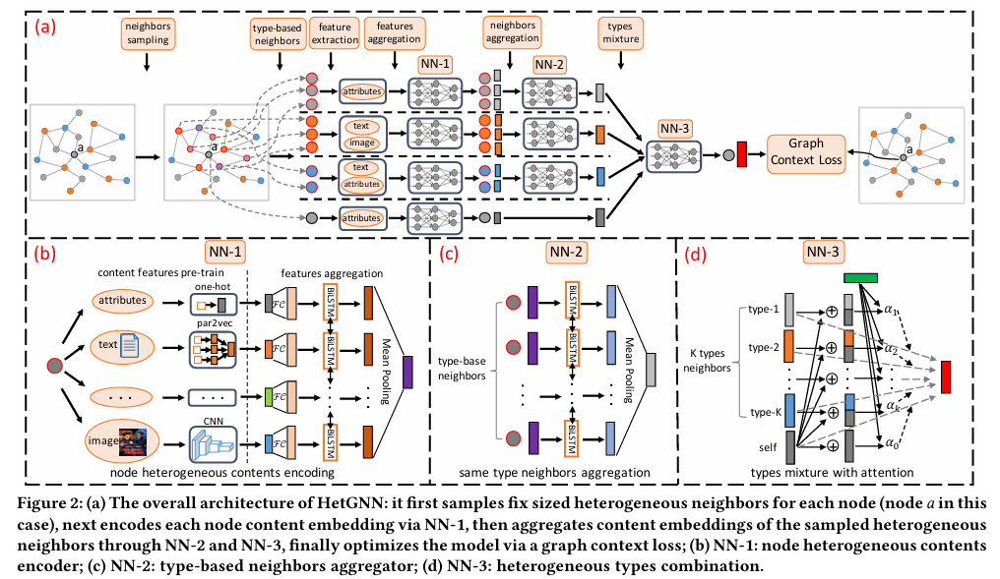
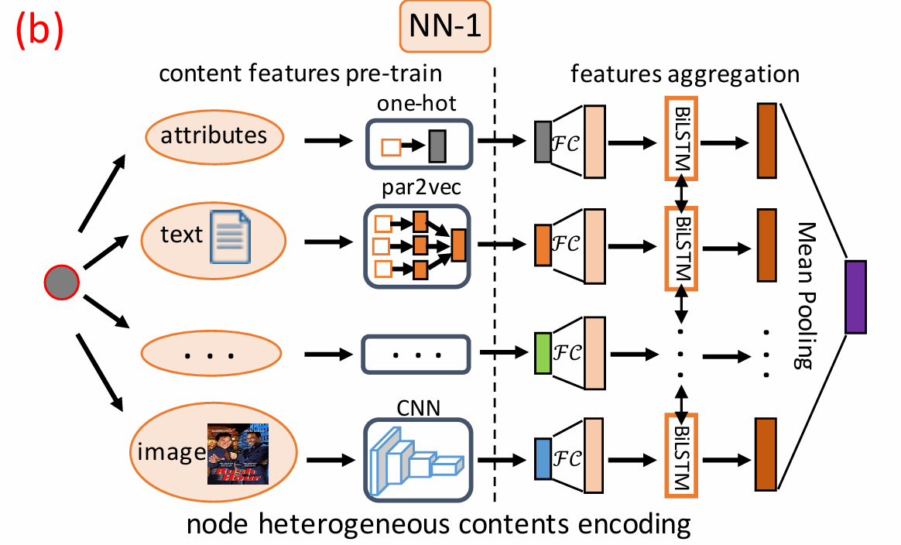
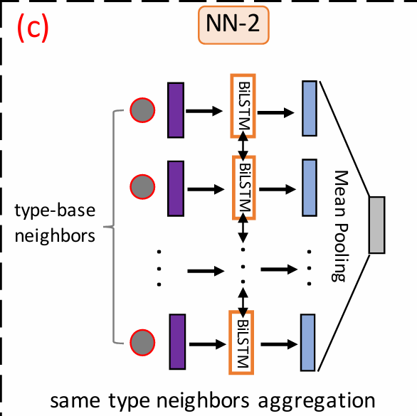

# Heterogeneous Graph Neural Network

> DOI:
> publication: KDD 2019
> Date of publication: 2019-07-25

---

<!-- more -->

* heterogeneous:
    * graph structure heterogenerity
    * node content heterogeneity (multimodal)

## Definition

* content associated heterogeneous graph(C-HetG):$G=(V, E, O_V, R_E)$
* node type set: $O_V$
* edge type set: $R_E$

## HetGNN

### sampling heterogeneous neighbors
* issues:
    * hub node: 
    * "cold-start" node

* step 1: sampling fixed lenght RWR
    random walk from node $v$ -> travels to the neighbors of current node or returns to the starting node with a probability p.

* step 2: grouping neighbor types
    for each node type, select top-k frequent node

* the t-type sampled neighbor set of $v$:$N_t(v)$
* feature:
    * all type of neighbors
    * fixed sample size
    * type-based aggregation

### encoding node heterogeneous contents

* content of node $v$: $C_v$
* embedding model $f_1$: $x_i \in \mathbb{R}^{d_f \times 1}$
    depend on content type
* bi-directional LSTM(Bi-LSTM)
$$f_1(v) = \frac{\sum_{i \in C_v} \left[ \overrightarrow{\text{LSTM}} \left\{ \mathcal{F} C_{\theta_x}(x_i) \right\} \oplus \overleftarrow{\text{LSTM}} \left\{ \mathcal{F} C_{\theta_x}(x_i) \right\} \right]}{|C_v|}$$

    different BiLSTMs for different types of nodes
* same dimension d

### aggregating heterogeneous neighbors

* step 1: same type neighbors aggregation
    
    $f_2^t(v) = \mathcal{AG}^t _{v' \in N_t(v)} \left\{ f_1(v') \right\}$
    * $\mathcal{AG}^t$: aggregator(FCNN/CNN/RNN) BiLSTM here
    * unordered neighbors set

* step 2: types combination
    attention machanism: combine type-based neighbor embeddings & node $v$'s content embedding
    $$E_v = \alpha^{v,v} f_1(v) + \sum_{t \in O_V} \alpha^{v,t} f_2^{t}(v)$$
    * different contributions for different neighbor types
    $$
    \alpha^{v,i} = \frac{\exp \left\{ \text{LeakyReLU}\left(u^T [f_i \oplus f_1(v)]\right) \right\}}{\sum_{f_j \in \mathcal{F}(v)} \exp \left\{ \text{LeakyReLU}\left(u^T [f_j \oplus f_1(v)]\right) \right\}}$$

### formulating the objective and designing model training procedure

graph context loss:
$$o_2 = \sum_{\langle v, v_c, v_{c'} \rangle \in \mathcal{T}_{walk}} \log \sigma(\mathbf{E}_{v_c} \cdot \mathbf{E}_v) + \log \sigma(-\mathbf{E}_{v_c'} \cdot \mathbf{E}_v)$$

* $v_c$: context node(neighbor of $c$) positive sample
* $v_{c'}$: negative sample

The embedding proximity of positively sampled nodes to c is maximized

## Experiments
### link prediction
a binary logistic classifier

### Recommendation
personalized node recommendation: author-venue link
* preference score: the inner-product between embeddings of 2 nodes

### Classification and Clustering

## Hyper-parameters
* d: 128-256
* sampled size: 20-30(noise)

## Code
> to read