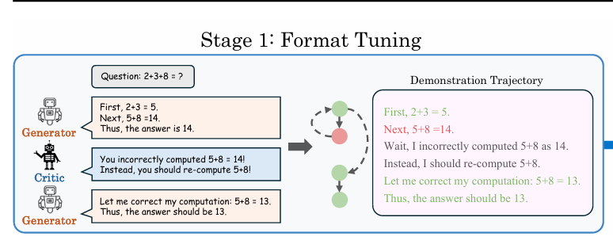
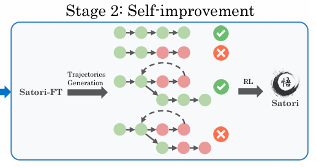
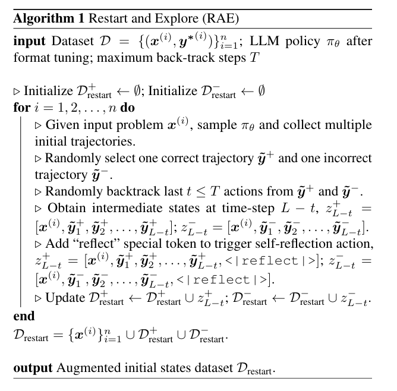

# Satori: Reinforcement Learning with Chain-of-Action-Thought Enhances LLM Reasoning via Autoregressive Search

> DOI:
> publication: 
> code: coming soon:)
> Date of publication: 2025-02-04

* Chain-of-Action-Thought(COAT)

* autoregressive searching on post-training LLM

<!-- more -->
## Structure

* meta-action tokens
    * `<|continue|>`
    * `<|reflect|>`
    * `<|explore|>`
    each reasoning step starts with a meta-action token

## Training

### step 1: small scale format tuning stage to interalize COAT reasoning form

learn to reacting with meta-action tokens

format tuning (FT)

* multi-agent data synthesis framework
    * generator
    * critic
    * reward model

* behavior cloning

### step 2: large scale reinforcement learning with "Restart and Explore"(RAE)

self-improve

* Restart and Explore (RAE)

