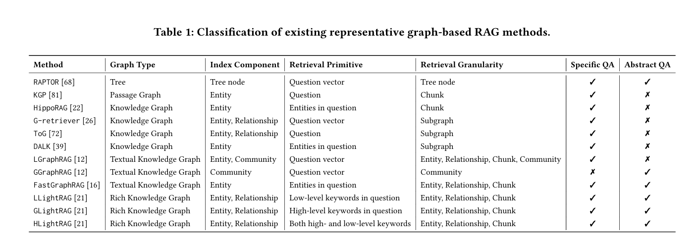

# RAG Review
<!--
to do

<Document Parsing Unveiled: Techniques, Challenges,and Prospects for Structured Information Extraction>

文档解析の综述

RAM-EHR:电子健康记录的检索
-->

> update map

> - 20250314 In-depth Analysis of Graph-based RAG in a Unified Framework

---
<!-- more -->

---

## 框架
### Naive RAG
* 结构
    * 文本切分成小段
    * 利用某种 Transformer 编码器模型，将这些文本段转换成向量形式。
    * 把所有向量汇集到一个索引里
    * 为LLM制定一个提示词

* 双塔模型

### Advanced RAG

分块 向量化 索引

### Graph RAG

> 结合图数据库(知识图谱)
> https://github.com/microsoft/graphrag

#### basic
* 适用
    处理私有数据集/复杂信息
* 结构
    * 索引
        * 输入语料库切分成 TextUnits
        * 使用LLM从TextUnits内提取实体/关系/属性
        * 对图像执行层次聚类构建知识图谱
        * 社区报告/摘要
    * 检索
        * 根据用户查询从图数据库里提取相关元素(实体/三元组/路径/子图)
        * DRIFT
            * top-k社区
            * 根据初步答案迭代两次
    * 生成

* 局限
    * 领域专家验证：GraphRAG 生成的响应可能需要领域专家对答案进行人工分析，以验证和增强响应的准确性

    * 资源消耗较高

    * 复杂性限制灵活性和可扩展性

#### nano Graph RAG

> 轻量级的 Graph RAG

* 优化&简化
    * 未实现协变量特性 ==?==
    * 全局搜索时只填充top-k社区

##### Medical Graph RAG
* 结构
    * 三层次图结构(实体 - 文献 - 字典) -> 元图 -> 合并成
    * U-检索
        * 自上而下检索
        * 自下而上响应生成
    * 基于混合静态语义方法的文档分块
    * 基于证据 可解释性

##### LightRAG
* 优化
    * 优化检索
    * 增量更新

##### fast-graphrag
    
### KG-RAG
> 联合知识图谱

####  Community KG-RAG

* 结构
    * 增加对知识图谱中实体的聚类
    Louvain算法: 社区检测
    实体相关性 & 相似性
    * 多跳连接
* 适用
    * 零样本
    * 检索有效性（上下文感知）
* 局限
    * 实体识别幻觉

### KAG
> https://arxiv.org/pdf/2409.13731
> https://github.com/OpenSPG/KAG/blob/master/README_cn.md

* 解决
    * 向量相似度与知识推理相关性

* 结构
    * kg-builder
        * 知识图谱 - 原始文本 的索引
        * 兼顾无约束和有约束的信息提取
        * DIKW 层次结构
    * kg-solver
        * 自然语言 -> 逻辑の问题求解过程
        * 四种运算: 检索、知识图谱推理、语言推理和数值计算
        * 实体对齐(对实体/概念/关系等增加描述性文本)
    * kag-model

* 局限
    * 臃肿？

### Rule RAG

> 引入符号规则作为ICL示例
> https://doi.org/10.48550/arXiv.2410.22353
> https://github.com/chenzhongwu20/RuleRAG_ICL_FT

* 适用
    for:提升医学视觉-语言模型（Med-LVLM）的事实准确性
    知识密集型问答
* 结构
    * **规则** 自然语言描述(实体间关系的逻辑)
    * RuleRAG-ICL: 根据查询规则检索
        * 对某查询q，从规则库中选取相关规则r，构成指导规则集
        * 将查询与每个规则依次结合，检索top-k相关文档
        (q提供检索内容，r提供检索方向)
        (单独检索防止逻辑冲突)
        * $relevance(docu, q \circ r) = Encoder_{doc}(docu) \cdot Encoder_{query}(q \circ r)$
    * RuleRAG-FT: 
        * RGFT-retriever:检索时区分正例和负例，对比学习趋向正例
        * RGFT-generator:根据检索文档和规则生成答案
    
* 规则挖掘
    * AMIE3: 规则挖掘算法[知识图谱中频繁出现的模式可作为规则][适用: static KG]
    * TLogic: 时间敏感信息规则挖掘算法[适用: temporal KG]

* 局限
    * 规则局限性
    * 系统复杂性
    * 规则的应用范围 &  表达能力
    * 计算复杂性
### Struct RAG

> 混合信息结构化

* 结构
    * *Hybrid Structure Router*
        * Optimal Type(表/图形/算法/目录/块)
        * Question + Core Content ->
        * 偏好优化算法DPO: MLE优化决策
            * seeding
            golden tasks(手动)
            * synthesizing
            * simulating
            * judging
            LLM -> 用于训练Router的综合优先级对
    * Scattered Knowledge Structurizer
        * 构建结构化知识 + 描述
    * Structured Knowledge Utilizer
        * 问题分解
        * 精确知识提取
        * 最终答案推理
* 适用
    * 复杂性任务

### Self-RAG

自反思
* 结构
    * 自适应检索 根据需求
    * 生成答案
    * 自我批评: 评估答案
    * 根据评估结果决定重新检索/重新生成

### 基于智能体的RAG

模块化多智能体

COT?

* 优
    * 复杂问题的理解和处理能力
    * 工具集成

### METRAG（Multi-layered Thoughts enhanced RAG）

多层级思考: 相似性 实用性 紧凑性

* 结构
    * 检索: 相似性 + 实用性
        REALM
    * ==任务自适应摘要==
    紧凑性
* 适用
    * 任务密集型任务
* 局限
    * 依赖LLM监督质量
    * 超长文本

### RAFT（Retrieval Augmented Fine-Tuning）
> RAG + SFT

CoT  + 负例文档

* 结构
    * 检索
    * 微调
    p%: Q + oracle docu + distractor docu; (1-p)%: Q + distractor docu
    * 生成

* 适用
    * 垂直领域问答
    * 抗干扰
* 局限
    * 算力
    * 领域限制
    * 文档质量
### MKRAG(Meta Knowledge RAG)
* 结构
    * 准备数据 Claude 3
    * 重写
        * 聚类->元数据
        * 每个类: QA对(by CoT)
        * 每个类: 元知识摘要(MK Summary)
    * 检索 查询增强
    * 生成
* 适用
    * 大量文本
    * 搜索广度
* 局限
    * 检索&生成の连贯性

### RAPTOR
> 摘要树 层次化

* 结构
    * 递归(聚类->摘要->...)
    * 形成多层次的摘要树
    * 基于高斯混合模型（GMM）的软聚类方法
        * 无需指定聚类数量
        * 可同时属于多个聚类
* 适用
    * 长文本
* 局限
    * 动态增长的数据集
    * 检索质量

### FILCO
* 结构
    * 检索
    * 上下文过滤
        * 根据各质量评价策略打分
            * 蕴含策略 句子与查询之间的蕴含分数
            * 词汇重叠策略 句子与查询的词汇重叠程度
            * 条件互信息策略 句子对生成答案的条件互信息
            ==条件互信息?==
        * 训练上下文过滤模型
        根据分数选最优
    * 生成

==Q:上下文质量 & 检索相似性 差异==
* 适用
    * 解决对检索段落过度或不足依赖的问题
    * 计算资源少
* 

### Self-Route

模型自省
查询动态分配给 RAG / LC

### SFR-RAG
* 外部上下文信息
* 指令调整

稀疏特征检索

* 适用
    * 大规模文档
    * 速度/资源 限制

### LA-RAG
语音

### HyPA-RAG
混合参数自适应
==待看==

* 适合
    * 法律和政治背景下的知识过时和幻觉问题
    * 复杂文本

### MemoRAG
双系统架构？

* 适用
    * 模糊 & 非结构化知识

### NLLB-E5
多语言
### Hybrid RAG

* 结构优化
    * 结构化知识 + 非结构化知识
    * 向量检索 + 结构化查询
    * 交叉注意力机制: 融合不同类型知识的表示
    * 上下文编码 + 建模
    * 生成策略(什么时候用结构化知识, 什么时候用非结构化知识)
    
---

## 分块器
> 标记级/句级(文本语义和简洁性之间的平衡)/语义级
### 固定大小

> 忠实性 / 相关性

### 语义
语义距离阈值
### 聚类
不连续

## 检索器
### BM25
> 词频-逆文档频率(TF-IDF) + 饱和函数 + 文档长度因子

$Score(D, Q) = \displaystyle \sum_{i=1}^{n}\frac{IDF(q_i) \cdot f(q_i,D)\cdot(k_1 + 1)}{f(q_i, D) + k_1 \cdot(1 - b + b\cdot \frac{len(D)}{avg\_len})}$

$usually, k_1=1.5,b=0.75$

* 优
    * 关键词匹配
* 劣
    * 无法捕捉词与词关系，复杂语义

### 密集段落检索（Dense Passage Retrieval，DPR）

> 双编码器 + 最近邻

* 优
    * 语义相似性
    * 针对性预训练

### REALM（Retrieval-Augmented Language Model）
> 检索器与生成器协同优化
> 相关性 + 高质量

Self-RAG（Self-Reflective Retrieval-Augmented Generation）
REPLUG（Retrieval-Augmented Black-Box Language Models）

* 劣
    * 计算成本
### HyDE
## 生成器
> 背景组成
### T5（Text-to-Text Transfer Transformer）

### BART（Bidirectional and Auto-Regressive Transformer）
* 优
    * 嘈杂输入
    * 损坏重建
## 局限
## 实时高效检索
### 检索精准度
& 检索质量
* 查询扩展

* 上下文消歧

### 计算成本

* 模型剪枝

* 知识蒸馏

### 伦理

* 偏见

* 透明度

### 语言支持
### 连贯性

## 其他
* HTML 优于纯文本
    * 洗HTML
    * merge->构建块树
    Beautiful Soup-> DOM树
    * 剪枝
        * 基于文本嵌入的块剪枝
        * 贪心
* pdf2markdown
* 元数据
    * 标题、关键词和假设问题
* 查询处理
    * 查询重写
    * 查询分解
    * 伪文档 HyDE
* 重排序
    查询后
    * DLM 性能优化
    * TILDE 效率
* 文档重包装
    * 边缘处(相关信息放在输入的头部或尾部时) 效果最佳
* 摘要
    * 抽取式/生成式

---

## Summary

* 图结构: Graph RAG / KG-RAG
    * 搜索简化: nano Graph RAG
    * 多层图 + U-检索: Medical Graph RAG
    * 图的增量更新: light RAG
    * 社区聚类 多跳链接: Community KG RAG

* 树结构
    * 层次化聚类的摘要树: RAPTOR
    * HTML RAG / pdf2markdown

* 非结构性(文本)
    * 规则匹配 + 正反例结合 Rule RAG
    * 检索REALM + 自适应摘要: METRAG
    * 元数据重写 + 摘要: MKRAG
    * 检索后上下文过滤: FILCO
    * 稀疏特征检索: SFR-RAG

* 多结构
    * 知识图谱-原始文本 + 多层次 + 实体对齐: KAG
    * 最适结构决策:Struct RAG 
    * 交叉融合: Hybrid RAG

* tricks or 整体
    * 自我评估答案重新检索/生成: self-RAG
    * 分解问题: 基于智能体的RAG
    * 负例: RAFT
    * 自省是否RAG: Self-Route
