# 神经生物学
> 期末 40% + 课堂表现（考勤+提问）20% + 文献讨论 40%

* 著名案例
    * Gage 铁棍穿脑->动物本能
    * Broca 左脑语言区
    * “记不住”的Henry Molaison/“被记住”的H.M.病人 内侧颞叶的切除手术
* 大脑功能定位学说
* 脑功能整体论：所有大脑的组织都是等势或等能的，脑是作为一个统一整体进行工作的。
* 现代神经科学：神经元（高尔基/卡哈尔）
* 神经细胞：恒定的、暂时性的兴奋形变化。/连接处：易变的、持续性的变化。
* 突触/谢灵顿定律:交互神经支配
* 分子时代:乙酰胆碱的发现-两个青蛙实验

## 神经系统基本结构与功能

* 中枢神经系统 (centralne1-voussystem, CNS)
  
  脊椎动物CNS：脑(brain) (前脑 (forebrain)、中脑和后脑 (hindbrain))和脊髓(spinal cord)(颈段、胸段、腰段和祗段)[躯干肢体的感觉&控制]
  * 脑干
    头部感觉运动/脑&脊髓双向传递/网状结构调节觉醒和意识
    * 延髓 medulla
    生命活动自主神经中枢
    * 脑桥 pons
    小脑大脑间运动传递
    * 中脑 midbrain
    协调感觉运动(眼球反射/视听运动)
  * 间脑 diencephalon
    中脑头端
    * 丘脑 thalamus
    编码/->大脑皮层/调节睡眠&清醒
    * 下丘脑 hypothalamus
    调节自主活动/内分泌/内脏
    * 垂体 pituitary gland
    激素
  * 大脑 cerebrum
    * 大脑皮层 cerebral cortex
    感觉运动控制和自主神经活动最高中枢/学习记忆语言思维活动结构基础
    * 基底神经节 basal ganglia
    运动调节
    * 海马 hippocampus
    学习记忆
    * 杏仁核 amygdala
    情绪自主/内分泌反应
  * 小脑 cerebellum
* 周围神经系统 (peripheral nervous system, PNS)
  联结 CNS 中的脑干、脊储与身体和内部器官的神经 (nerve, 离散的轴突束 )，以及神经节 ( ganglia, 神经元的集群)。 

切面:冠状切面 (coronal section)/矢状切面(sagittal)/水平切面 (horizontal section)

<mark>记忆：脑的结构分区(包括英文)<mark>
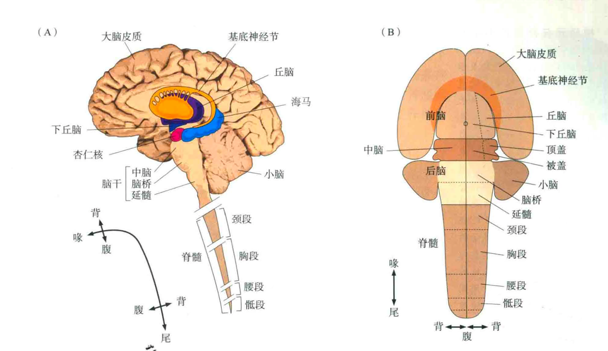

* 神经系统
  * 神经元 neuron

      感受刺激+传导兴奋
    * 轴突 axon (轴浆 axoplasm: 双向运输)
    * 树突 dendrite (树突棘 dendrilic spine [脑和脊髓重要结构标志])

      梯度电位传播(不是动作电位)
    * 细胞骨架(微管+微丝+神经丝) 神经极性基础/指导细胞内信号通路
    * 胞体
      尼氏体: 合成大部分pr
    * 分类
      * 多极/单极(伪单极)/双极
      * 感觉(传入神经)(大多单极)/运动(传出神经)(大多多极)/连体神经
  * 神经胶质细胞 glia/neuroglia cell [轴突外侧有髓鞘]
    * 少突胶质细胞 oligodendrocyte
    CNS中髓鞘(绝缘)-朗飞结
    少突胶质 + 有髓轴突 -> CNS白质 white matter
    * 施万细胞 Srhwann cell
    PNS中髓鞘1:1
    * 星形胶质细胞 astrocyte
    脑灰质 gray matter
    发育&调节-损伤处增生形成瘢痕/抗原提呈
    * 小胶质细胞 microglia
    免疫: 吞噬出现损伤的细胞和细胞碎片/识别神经元间连接
    * 作用

      支持作用(星形胶质细胞)/绝缘 屏障作用(髓鞘/血脑屏障)/保护 修复 再生作用(小胶质细胞/星形/施万)/物质代谢和营养作用(星形胶质细胞)/免疫应答反应(星形/小胶质细胞)/维持离子平衡作用(星形)/对神经递质的调节/合成神经活性物质(神经营养因子/细胞因子)/神经干细胞功能/对神经元功能的调制(ATP...)/星形胶质细胞的”可兴奋性”/胶质细胞突触可塑性与学习记忆  

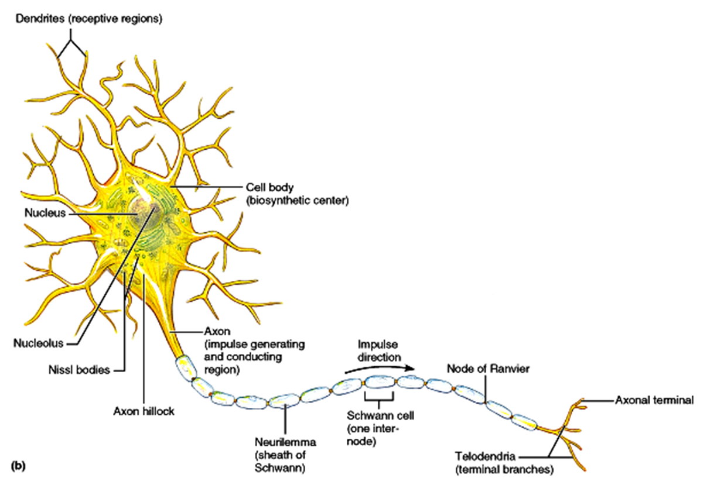
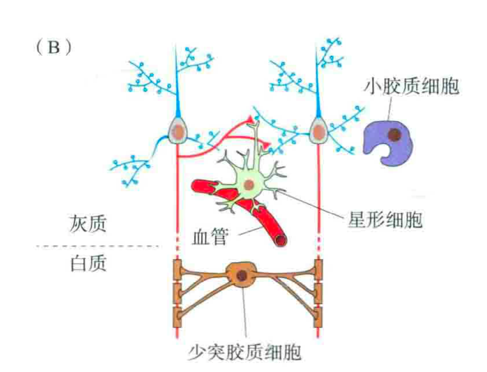

* 物质转运
  * 单纯扩散 simple diffusion 脂双层
  * 膜蛋白介导(离子通道(电压/化学/机械门控/水通道)/转运蛋白)
    * 被动转运 passive transport [浓度差/电位差]
      * 通道介导的易化扩散 facilitated diffusion
      * 载体介导的易化扩散
    * 主动转运 (active transport)(ATP)
      * 离子泵介导的原发性主动转运 
      * 继发性主动转运 
  * 膜运动(ATP)
    胞吞 endocytosis/ 胞吐  exocytosis

<mark>此图需要简单记忆<mark>
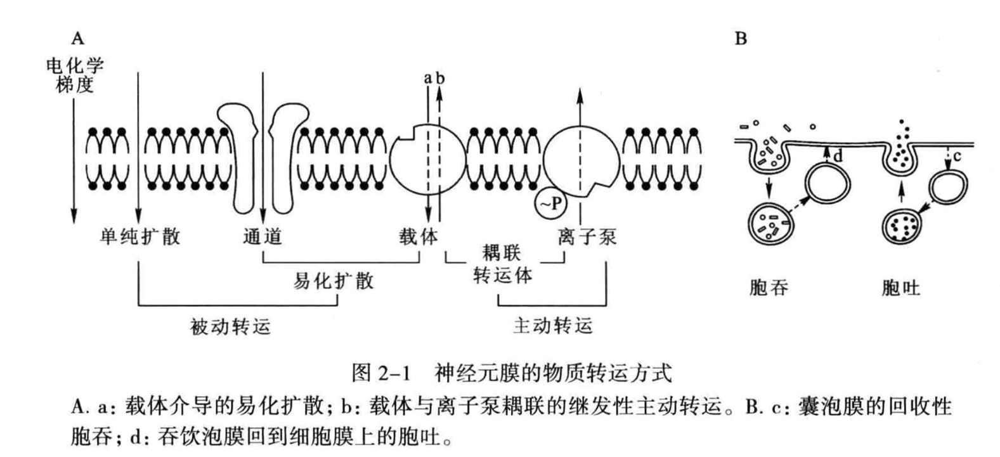
>如何用突触的形态特征鉴定突触的功能?

>什么是静息电位？

>什么是Nernst方程？

## 突触结构与功能
* 突触 synapse 9种(化学/电: 间隙小/两侧膜均无增厚/无襄泡/连接子形成缝隙连接通道-快/双向/无延搁/染料耦合) 可共存

  以下为化学突触:
  * Ⅰ型突触: 后膜胞质面致密物质比前膜厚，故又称为不对称突触; 突触小泡呈球形，突触间隙较宽（20～50nm）；一般认为是兴奋性突触，主要分布在树突干上的轴-树突触。
  * Ⅱ型突触: 前后膜的致密物质较少，厚度近似，故称为对称性突触, 突触小泡呈扁平形，突触间隙也较窄（10～20nm）。认为是一种抑制性突触，多分布在胞体上的轴-体突触
  * 突触前成分:突触囊泡 synaptic vesicle[单位膜/递质合成贮存释放基本单位/神经递质量子释放基础] 
    * 无颗粒囊泡[电镜下均匀致密]: 其直径范围为 31-60 nm 乙酰胆碱(ACh)/谷氨酸/r-氨基丁酸 (GABA)/甘氨酸等
    * 颗粒囊泡[致密核心]: 40-70 nm 的为小颗粒囊泡，直径大于 80 nm 的为大颗粒囊泡 甲肾上腺素(NE)/5- 经色胺 (5-HT)/多巴胺 (DA)[大]/P物质/其他神经肽(高频或串刺激/主要酶解不重摄取/胞体合成-内质网-高尔基体/可塑性水平↑/作用:递质调质激素/受体多为G-pr)等递质

    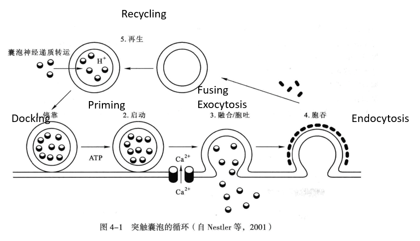
  * 突触间隙:
    电子致密物质 黏多糖(又称糖胺聚糖)/糖蛋白[突触的识别]/唾液酸[与递质分子结合并将其向突触后膜转运]
  * 突触后成分: 突触后致密质PSD(pr)

## 神经信号的整合与信息传递

> 平衡电位特点: 仅需要微小的离子浓度改变就可以引起膜电位大幅度的变化

> 离子驱动力 $V_m-E_{ion}$

> Nernst 方程: $E_K=\displaystyle\frac{RT}{ZF}ln\frac{[K+]_o}{[K+]_i}$
* 静息电位: 神经元活动时各种瞬时电变化基础(膜的内外侧面)

  基本因素:
  * 带电离子跨膜分布的不均衡性
  * 细胞膜不同条件下对离子通透性变化
  * 离子浓度梯度/电位梯度/离子泵(Na-K泵/偶尔 生电性钠泵)作用下K+膜转运平衡电位
  > 平衡电位特点: 仅需要微小的离子浓度改变就可以引起膜电位大幅度的变化
  
* 神经电信号
  * 局部电位: 神经元膜的局部兴奋性变化
    * 电刺激<mark>?<mark>
    * 感受器电位(换能作用):只在局部(感受器细胞内为感受器电位 感觉神经末梢为发生器电位)
    * 突触电位[兴奋/抑制]
    * 效应器电位
    * 自发膜电位振荡(起搏)/局部电流引起的膜电位变化(已兴奋部位与未兴奋部位之间形成局部电流环路)
  
    特性:
    * 等级性/刺激强度依赖性
    * 电紧张性扩布/局限性:被动扩布(不能长距离传导)
    * 总和性(空间/时间)-信息整合
  * 动作电位: 局部电位(->阈电位)-锋电位(去极化相-反极化/超射-复极化)-后电位(去极化-超极化) 神经电信号通用形式/神经信息编码基本单元(神经元兴奋和活动的标志)

    特性: 
    * 全或无: 非等级性/非刺激强度依赖性
    * 全幅式传导性: 不衰减[空间]
    * 不可叠加性: 不应期(绝对不应期-相对不应期-超常期-低常期)[时间]

    离子机制:
    
    1. 锋电位产生
    * 神经元的RP是锋电位产生的基础
    * Na+浓度差+Rp偏离$E_{Na}$
    * 刺激引起 Na+通道的大量开放

    2. 锋电位平衡
    顶点->在接近ENa水平时， Na+的内流与K+的外流又达到了新的平衡

    3. 下降
    Na+通道失活 电压门控K+通道激活
    K+因浓度差外流

    记录:
    1. 电流钳: 电流不变记录电位: 记录的是AP
    2. 电压钳: 离子跨膜移动情况 膜电流-> 膜片钳

    阈电位: 引起再生性Na+内流的膜电位水平-纯电压控制机制

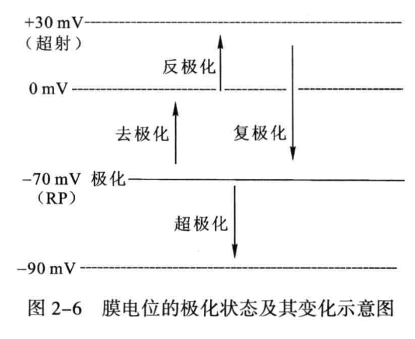

* 神经信息的编码[基本单元:动作电位]

  rate/temporal/population
  发放频率/发放模式 - 序列的锋-锋间期
  * 发放模式
    * 位相型放电/间歇型放电
    * 紧张型放电/持续型/规则型
    
    电流强度 - 发放频率关系曲线 (I-F curve) (刺激电流强度-平均发放频率)

* 传播
  * 传导
    
    与邻近静息电位差-局部电流
    
    粗的/髓鞘(绝缘-跳跃式-减少能量损耗) 快

  * 传递
    
    双向性(生理情况下不出现)
  
    可兴奋细胞: 神经细胞/肌肉细胞/腺体细胞
    * 突触传递-化学/电

    化学突触传递:
    动作电位由轴突传入-突触前末梢去极化-电压门控Ca2+通道开放-Ca2+进入突触前末梢[Ca2+依赖性]-突触囊泡与突触前膜融合[SNARE假说:膜蛋白]-神经递质释放
      * EPSP: 谷氨酸  突触后膜对正离子 Na+和 K+ (主要是 Na+) 的通透性升高

      * IPSP: 甘氨酸/平氨基丁酸 (GABA) Cl-内流(Ecl与静息电位接近，所以IPSP的幅度还与突触后神经元的膜电位有关，有时甚至会产生翻转的 IPSP 去极化)

    
    * 非突触传递
      
      1:n 无前后膜特化结构 远/广 取决于效应细胞受体

ps: 细胞外液的 Ca2+浓度可以明显影响神经元的兴奋性。当其升高时，可降低兴奋性，反之相反。

* 突触可塑性
  * 短时程
    * 易化 facilitation
    * 压抑 depression
  * 长时程: 重复强直刺激
    * 长时程增强 long-term potentiation,LTP
    * 长时程抑制 long-term depression, LTD
  * 突触前抑制(轴突-轴突) 感受器

* 神经递质/神经调质

  突触前神经元内有合成该物质的前体和合成酶系统;
该物质主要储存在突触前神经元的囊泡内，可从囊泡内释放出来，进入突触间隙;
突触后膜上存在特异性受体，其效应可被外源性该物质所模拟;
存在使该物质消除的机制，如使之失活或分解的酶系统 、 重摄取环节等
有特异性的受体激动剂和阻断剂存在，能增强或阻断这一物质的突触传递作用 
  同一种物质可能同时兴奋性+抑制性
* 钙电流&钙离子
  * 钙电流的生理意义:
    * 改变膜电位;
    * 改变胞内 Ca2+浓度，参与信号转导;
    * 调控细胞内的代谢活动; 
    * 在神经末梢诱导神经递质的释放，在肌细胞诱发收缩活动等
  * 胞内钙离子平衡 电信号-生物效应
    * Ca2+ 通道: 电压门控钙通道和化学门控阳离子通道
    * 细胞内Ca2+ 库：Ca2+从Ca2+库释放到细胞质， 包括内质网类Ca2+ 库（IP3 型 Ca2+ 库和ryanodine (RyR) 型Ca2+ 库 ）和线粒体，吸收和释放Ca2+的细胞器 。Ca2+清除系统: 胞器上的Ca2+ 泵 (Ca2+-ATPase) 和细胞膜上的Ca2+ 泵及Na+/Ca2+ 交换
    * Ca2+ 泵: 是跨膜蛋白，通过消耗ATP，将钙离子从细胞质泵到细胞外或者内质网。回收大部分的Ca2+
    * Ca2+结合蛋白：与钙离子结合，缓冲胞内的钙浓度

## 受体、神经系统的发育

* 受体
  > 能与生物活性物质(神经递质/激素/活性肽/药物/毒素等)等配体结合并能传递信息-引起生物学效应的跨膜或细胞质内的生物大分子
  * 离子通道型受体

    离子通道的水相孔道: 
    * 通道的电导很高，单通道电导可达 10-30 pS。
    * 通过离子通道的离子跨膜运动速度远远大于载体转运的速度
    * 温度效应，将温度每升高10度时 引起电导变化的倍数定义为 Q10。钠电导和钾电导Q10约为 l.2
    * 离子通道仅有相对的选择性，而载体则具有严格的选择性
    * 决定特异性因素：孔道大小、离子形成氢键的能力及与孔道内位点相互作用的强度等

    特性
    * 特异性 (specificity) 高度的构象特异性
    * 饱和性 (saturability) 受体和配体的结合在剂量 -反应关系上饱和现象
    * 可逆性(reversibility) 配体与受体的结合通常通过离子键/氢键/范德华力等非共价键来维系(可逆) 
    
    
  * G蛋白耦联受体
    > 能与GTP（三磷酸鸟苷）结合的蛋白,是成员最多的一大类

    > 两种构象，即与 GTP结合时呈活化态， 与 GDP结合时呈失活态

    * 受体通过GTP催化激活G蛋白
    * G蛋白偶联受体
    * 效应蛋白：合成和讲解第二信使的酶、膜离子通道或膜转运蛋白
    
  * 与酶相关的单跨膜受体

    > 与酶相关的单跨膜受体本身具有酶的活性或与酶相结合，当其被激活时，随之激活本身或相关酶，直接作用于效应器级联信号转导通路

  * 转录调节因子受体

    > 配体: 类固醇激素等脂溶性激素

    > 细胞质/细胞核中: 核受体与细胞的增殖、分化和死亡等具有密切的关系 

* 神经系统发生概览
  1. 神经管的形成
    
      外胚层: 表皮(外胚层板:胚胎头部特定区域的外胚层增厚单独形成)/神经嵴(外周神经系统)/神经管(中枢神经系统)

      

      * 只有胚孔背唇是未 来神经板的命运决定者
      * 神经板是有早期原肠胚后部中胚层组织胚孔背唇所释放的分子长程诱导而成
      * 控制机制
        * 短程
          
          BMP信号: 抑制神经系统的形成 增强的BMP会使外胚成只分化成上皮细胞(胚孔背唇的信号分子拮抗 外胚层神经板细胞具有内在的潜能按照固有的程序发育成神经细胞)

          进入神经系统命运后，由delta/`notch`信号决定他们具体的细胞类型：神经前体细胞和支持细胞。
        * 长程

          由胚孔背唇分泌出的可溶性蛋白，它们到达原肠胚背部与那里细胞释放出来的BMP分子相结合，阻断其与受体的结合，抑制了随后的胞内信号过程， 使得细胞按照原来固有的程序发育成神经组织 。 
      
  2. 神经管的继续分化
    
      三脑泡阶段(前脑/中脑/菱脑/颈曲/头曲)-五脑泡阶段前(脑泡进一步分化成位于顶端的端脑和间脑，菱脑泡则一分为二成较前的后脑和后端的末脑)
      * HOX基因 (头部基因递减/尾部基因递增+外部环境调控(纤维生长因子/视黄酸))

      头尾轴的形成还依赖其他的特定信号分子
      
      背腹轴(BMP/Shh(Notch)浓度差)
      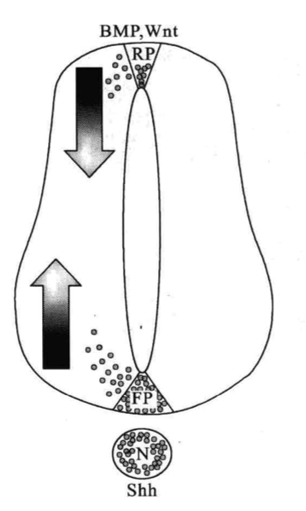

  3. 中枢神经系统发育
     神经干细胞的单一细胞层->不同亚层 神经核团
     `inside-out原则`:后生成的迁移至最外层(神经细胞/胶质细胞)内层继续分裂: 前体细胞迁移最终的位置取决于它何时离开细胞分裂周期
     
     小脑的组织生成: 胶质细胞引导

     大脑新皮层: 6层

  4. 周围神经系统的发育

     > 神经管闭合处的神经管细胞和与神经管相接的外表层细胞，它们间质细胞化而成为神经嵴细胞-迁移性

     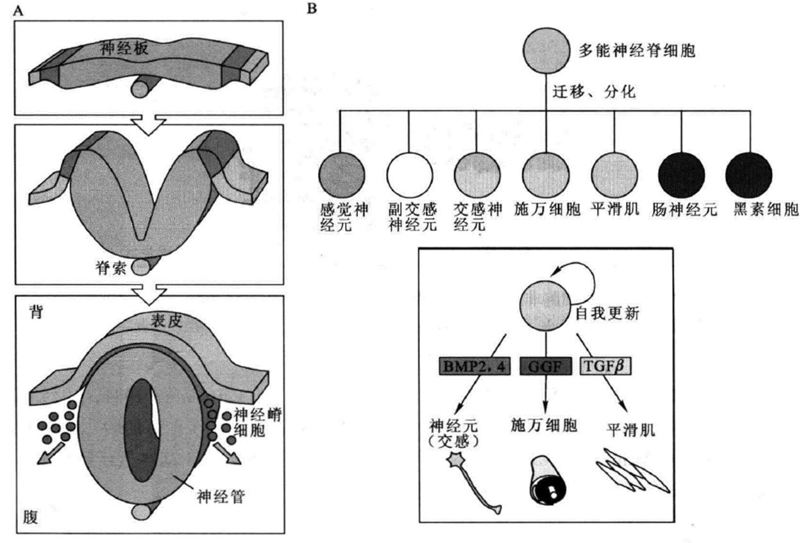

  5. 轴突的生长
     生长锥(轴突尖端扁平掌形结构): 感觉+运动
     
     环境因素/组织中生长因子和趋向因子的浓度梯度
     
     崩塌: 组织中抑制分子Semaphorin 和受体分子Neuropilin 和Plexin相互作用

  6. 突触的发生和再生

     > 突触(synapse)的形成和再生贯穿着整个生命过程
     
     * 发育中的轴突有选择地与靶细胞形成联系；
     * 轴突的生长锥分化成神经末梢；
     * 靶细胞将必要的构件安排到突触后膜上。

     神经营养因子
     
* 神经损伤
  * 神经元突起损伤 (轴突的断裂)

    > 影响突触伙伴和周围细胞

    * 轴突退化
    * 髓鞘破裂吞没
    * 神经胞体程序性死亡过程/染色质溶解反应

    * 突触剥夺/逆向变性 初级->次级
    危害恢复,上一级缩回,胶质细胞抑制
    * 出现支持侧支
    * 跨神经元萎缩
      * 正向
      * 逆向: 染色质溶解/纽扣脱落

  * 神经元胞体损伤（神经元的丧失）
    不可再生: 神经元的死亡，使其轴突和树突失去营养中心也随之死亡
  * 胶质细胞损伤
  
  分类: 外周神经损伤程度/能否修复
  * Seddon 标准
    * 神经失用（Neurapraxia）：神经的轻微压迫与牵拉，会导致神经传导速度减慢。可自行恢复。
    * 轴索断裂（Axonotmesis）：直接的神经轴索损伤和局部的脱髓鞘反应，但神经与神经结缔组织间的连接仍然完整。可自行恢复。
    * 神经断裂（Neurotmesis）：神经轴索与神经结缔组织完整的横切伤，神经连续性中断。神经无法自行修复，必须进行手术干预。
  
  * Sunderland 标准
    Ⅰ较轻的神经损伤/II神经轴索损伤可被观察，但尚未出现神经结缔组织损伤/III轴索断裂，其损伤涉及神经内膜的损伤/IV轴索断裂，其损伤涉及神经束膜的损伤/V神经断裂伤（Neurotmesis），存在神经轴索与神经结缔组织完整的横切伤，神经连续性中断

  
## 视网膜

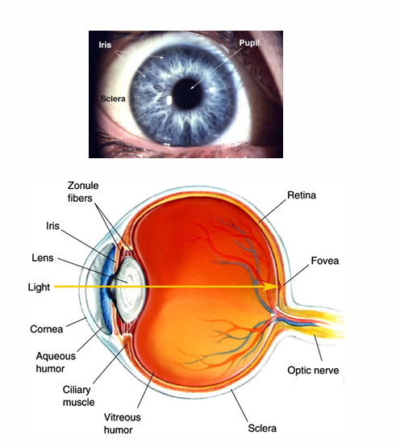

* 视角
* 视野
* 感受野
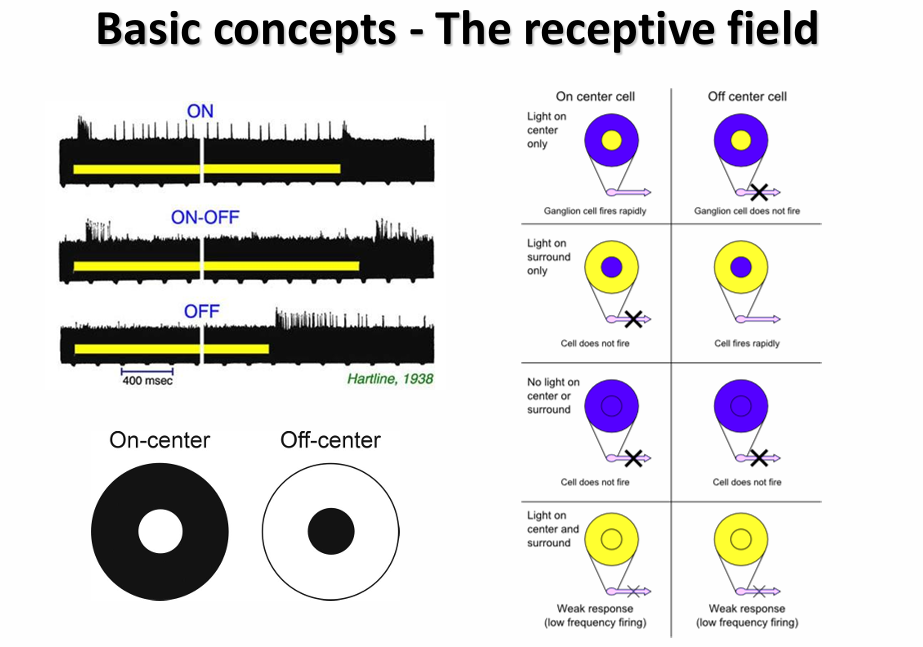

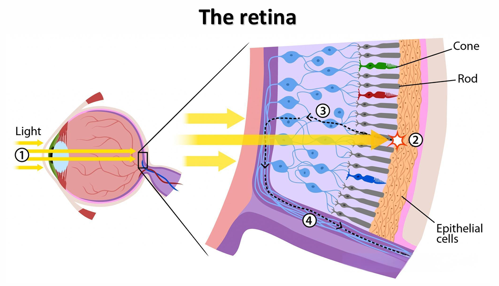

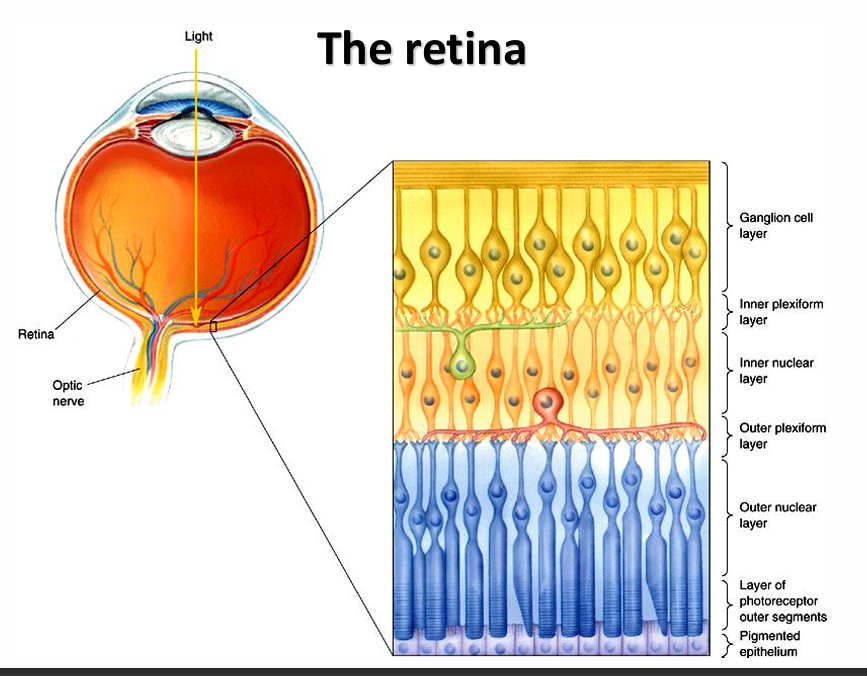

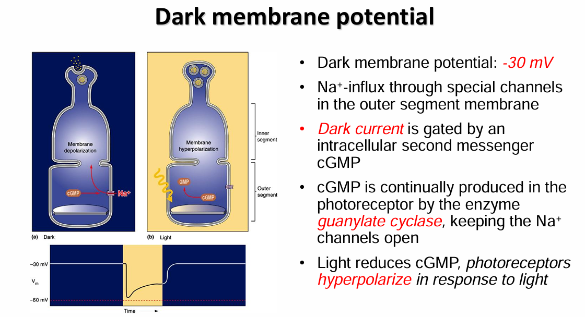
  
  视紫红质-光漂白-激活Gpr-激活效应器 磷酸二酯酶PDE(分解cGMP) - cGMP↓-Na+通道关闭/膜超极化 (注意是减少了第二信使)

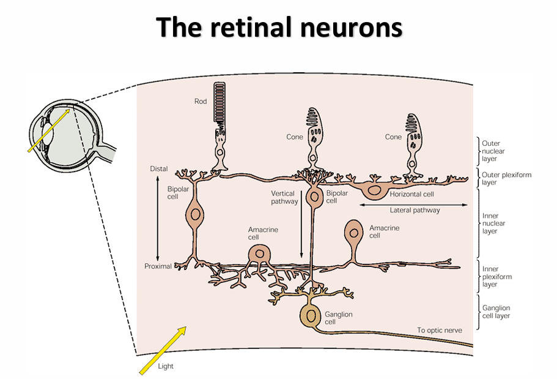

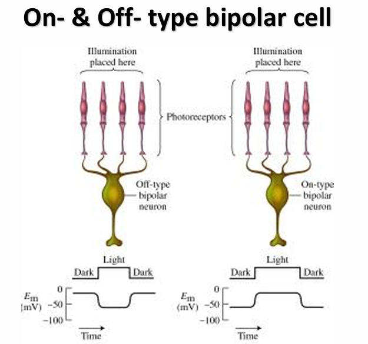

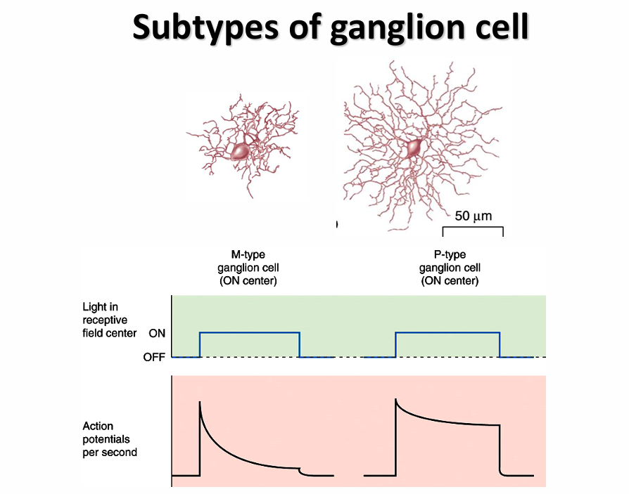

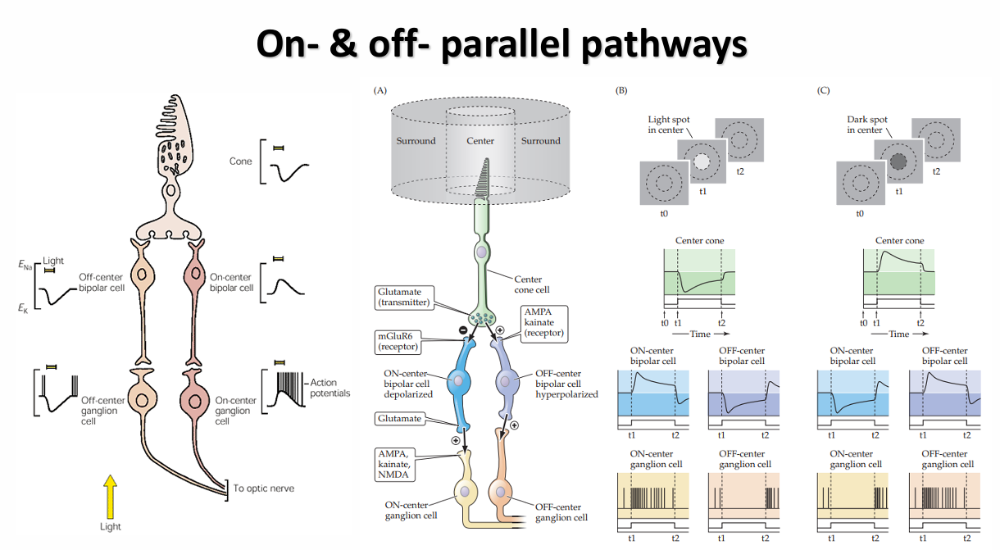
## 视中枢
Opponent
Process Theory of Color Vision
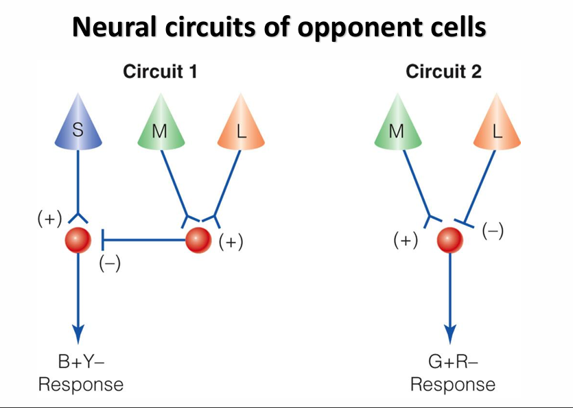

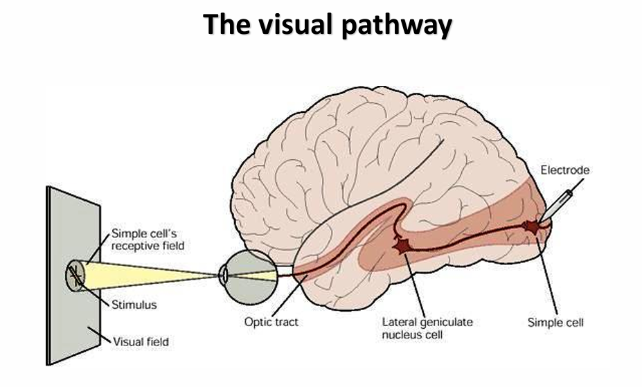

视神经 外漆体 视皮层

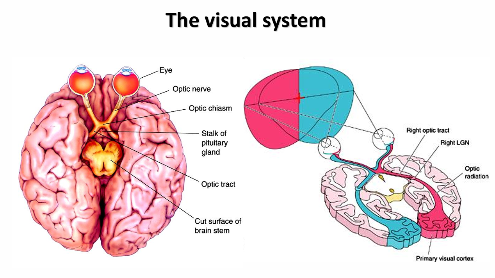
90% 外侧膝状体
10% 上丘 枕叶

瞳孔反射 动眼神经 前顶盖

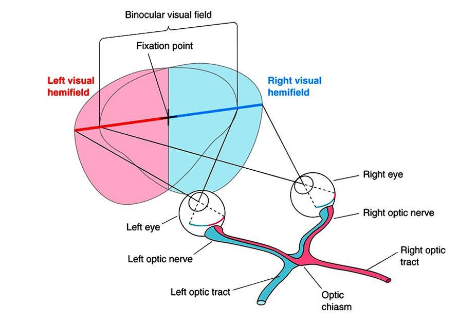

`second-spike` 效应

blob neurons 波长(颜色)敏感

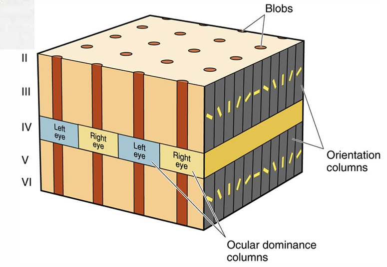
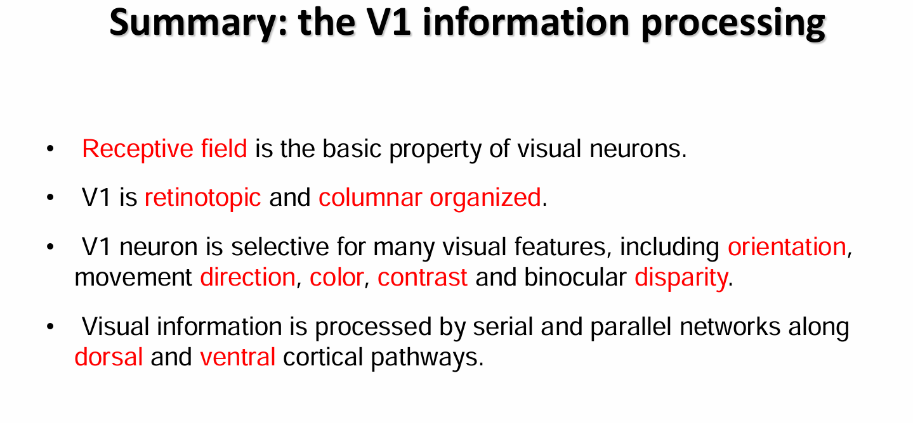
## 运动控制
## 脑的高级功能
## 脑衰老与疾病